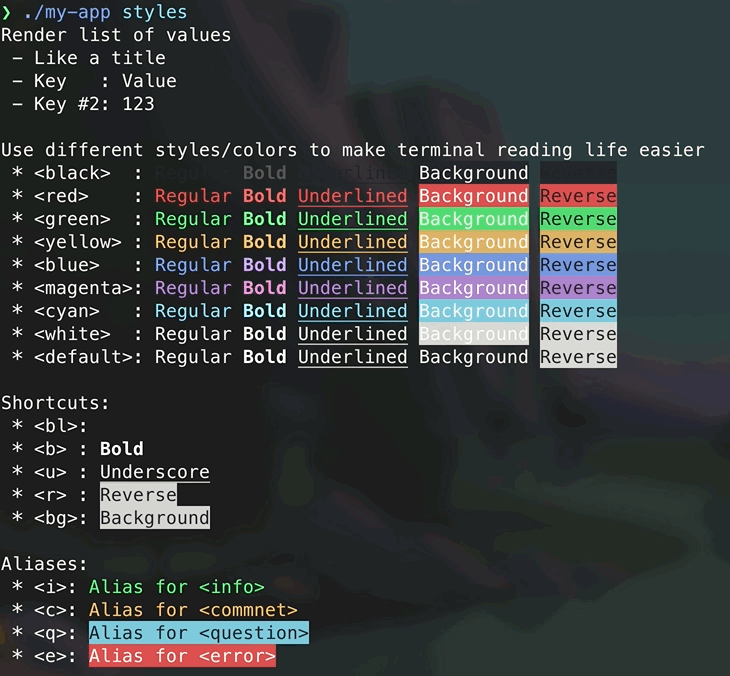
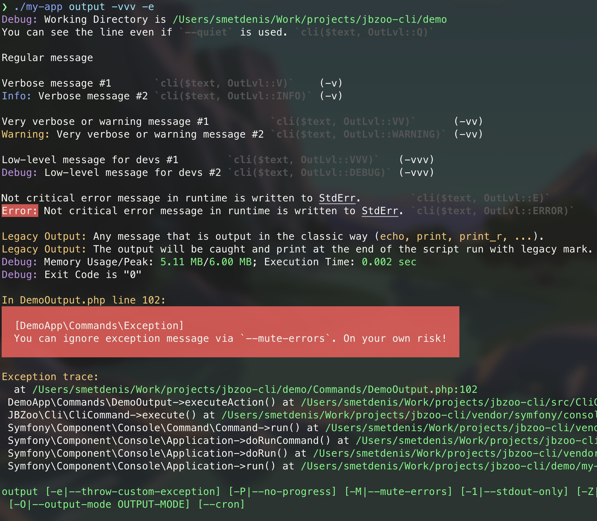
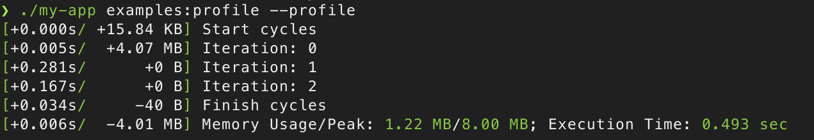
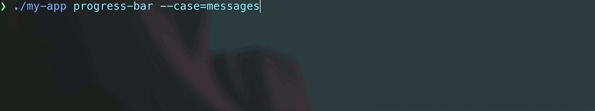
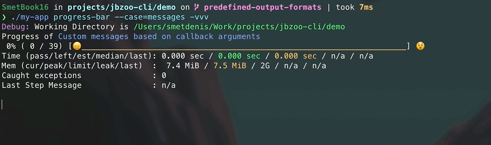
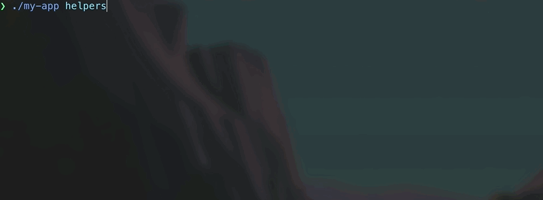
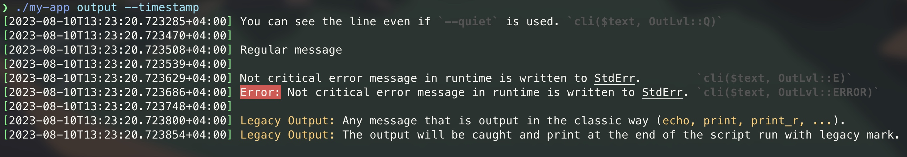
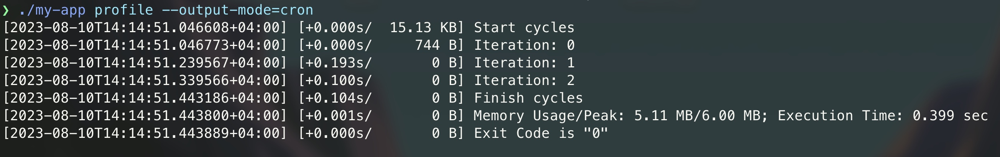
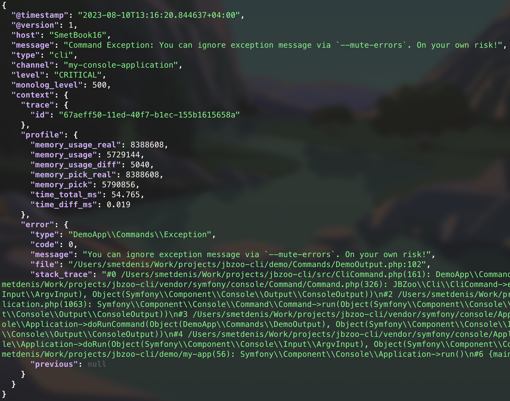

# JBZoo / Cli

[](https://github.com/JBZoo/Cli/actions/workflows/main.yml?query=branch%3Amaster)
[](https://coveralls.io/github/JBZoo/Cli?branch=master)
[](https://shepherd.dev/github/JBZoo/Cli)
[](https://shepherd.dev/github/JBZoo/Cli)
[](https://www.codefactor.io/repository/github/jbzoo/cli/issues)

[](https://packagist.org/packages/jbzoo/cli/)
[](https://packagist.org/packages/jbzoo/cli/stats)
[](https://packagist.org/packages/jbzoo/cli/dependents?order_by=downloads)
[](https://github.com/JBZoo/Cli/blob/master/LICENSE)


<!--ts-->
   * [Why?](#why)
   * [Live Demo](#live-demo)
      * [Output regular messages](#output-regular-messages)
      * [Progress Bar Demo](#progress-bar-demo)
   * [Quick Start - Build your first CLI App](#quick-start---build-your-first-cli-app)
      * [Installing](#installing)
      * [File Structure](#file-structure)
      * [Composer file](#composer-file)
      * [Binary file](#binary-file)
      * [Simple CLI Action](#simple-cli-action)
   * [Built-in Functionality](#built-in-functionality)
      * [Sanitize input variables](#sanitize-input-variables)
      * [Rendering text in different colors and styles](#rendering-text-in-different-colors-and-styles)
      * [Verbosity Levels](#verbosity-levels)
      * [Memory and time profiling](#memory-and-time-profiling)
   * [Progress Bar](#progress-bar)
      * [Simple example](#simple-example)
      * [Advanced usage](#advanced-usage)
   * [Helper Functions](#helper-functions)
      * [Regular question](#regular-question)
      * [Ask user's password](#ask-users-password)
      * [Ask user to select the option](#ask-user-to-select-the-option)
      * [Represent a yes/no question](#represent-a-yesno-question)
      * [Rendering key=&gt;value list](#rendering-keyvalue-list)
   * [Easy logging](#easy-logging)
      * [Simple log](#simple-log)
      * [Crontab](#crontab)
      * [Elasticsearch / Logstash (ELK)](#elasticsearch--logstash-elk)
   * [Multi processing](#multi-processing)
   * [Tips &amp; Tricks](#tips--tricks)
   * [Contributing](#contributing)
   * [Useful projects and links](#useful-projects-and-links)
   * [License](#license)
   * [See Also](#see-also)
<!--te-->

## Why?

JBZoo CLI Framework is a powerful PHP library that significantly extends Symfony Console functionality, making it easier and faster to create robust command-line applications. Built for PHP 8.2+, it provides enhanced features for professional CLI development.

### Key Features

**Enhanced Progress Bars**
- Advanced progress bars with debugging information and profiling capabilities
- Simple API: `$this->progressBar($items, $callback)` replaces complex Symfony ProgressBar setup
- Real-time memory and performance monitoring during execution
- See [Live Demo](https://asciinema.org/a/601633?autoplay=1&startAt=4)

**Strict Type Conversion**
- Type-safe option parsing with methods like `getOptInt()`, `getOptBool()`, `getOptString()`
- Built-in validation for allowed values and data integrity
- Eliminates common runtime errors from loose type handling

**Professional Output System**
- Simplified output API: `$this->_($message, $level, $context)` instead of verbose Symfony methods
- Rich styling with HTML-like tags: `<red>Error</red>`, `<green-b>Success</green-b>`
- Context-aware JSON logging for structured data

**Multiple Output Modes**
- `--output-mode=text` - User-friendly console output (default)
- `--output-mode=cron` - Optimized for crontab logging with timestamps and profiling
- `--output-mode=logstash` - JSON format for ELK Stack integration

**Performance & Debugging**
- Built-in profiling with `--profile` flag showing memory usage and execution time
- Timestamping with `--timestamp` for detailed logging
- Verbosity levels from quiet (`-q`) to debug (`-vvv`)

**Advanced Features**
- Multiprocessing support for parallel execution (not multithreading)
- Interactive helpers for user input, confirmations, and selections
- Error handling with configurable exit codes and output streams


## Live Demo

### Output regular messages

[](https://asciinema.org/a/601633?autoplay=1&startAt=4)


### Progress Bar Demo

[](https://asciinema.org/a/601621?autoplay=1&startAt=2)


## Quick Start - Build your first CLI App

### Installing

```sh
composer require jbzoo/cli
```


The simplest CLI application has the following file structure. See the [Demo App](demo) for more details.


### File Structure
```
/path/to/app/
    my-app                      # Binary file (See below)
    composer.json               # Composer file
    /Commands/                  # Commands directory
        Simple.php              # One of the commands (See below)
    /vendor/
        autoload.php            # Composer autoload
```


### Composer file

[./demo/composer.json](demo/composer.json)

<details>
  <summary>See Details</summary>

  ```json
  {
      "name"        : "vendor/my-app",
      "type"        : "project",
      "description" : "Example of CLI App based on JBZoo/CLI",
      "license"     : "MIT",
      "keywords"    : ["cli", "application", "example"],

      "require"     : {
          "php"       : "^8.2",
          "jbzoo/cli" : "^7.0"
      },

      "autoload"    : {
          "psr-4" : {"DemoApp\\" : ""}
      },

      "bin"         : ["my-app"]
  }
  ```

</details>


### Binary file

Binary file: [demo/my-app](demo/my-app)

<details>
  <summary>See Details</summary>

  ```php
  #!/usr/bin/env php
<?php declare(strict_types=1);

namespace DemoApp;

use JBZoo\Cli\CliApplication;

// Init composer autoloader
require_once __DIR__ . '/vendor/autoload.php';

// Optional. Set your application name and version.
$application = new CliApplication('My Console Application', 'v1.0.0');

// Optional. Looks at the online generator of ASCII logos
// https://patorjk.com/software/taag/#p=testall&f=Epic&t=My%20Console%20App
$application->setLogo(
    <<<'EOF'
          __  __          _____                      _
         |  \/  |        / ____|                    | |          /\
         | \  / |_   _  | |     ___  _ __  ___  ___ | | ___     /  \   _ __  _ __
         | |\/| | | | | | |    / _ \| '_ \/ __|/ _ \| |/ _ \   / /\ \ | '_ \| '_ \
         | |  | | |_| | | |___| (_) | | | \__ \ (_) | |  __/  / ____ \| |_) | |_) |
         |_|  |_|\__, |  \_____\___/|_| |_|___/\___/|_|\___| /_/    \_\ .__/| .__/
                  __/ |                                               | |   | |
                 |___/                                                |_|   |_|
        EOF,
);

// Scan directory to find commands.
//  * It doesn't work recursively!
//  * They must extend the class \JBZoo\Cli\CliCommand
$application->registerCommandsByPath(__DIR__ . '/Commands', __NAMESPACE__);

// Optional. Action name by default (if there is no arguments)
$application->setDefaultCommand('list');

// Run application
$application->run();

  ```

</details>


### Simple CLI Action

The simplest CLI action: [./demo/Commands/DemoSimple.php](demo/Commands/DemoSimple.php)

<details>
  <summary>See Details</summary>

  ```php
  <?php declare(strict_types=1);

  namespace DemoApp\Commands;

  use JBZoo\Cli\CliCommand;
  use JBZoo\Cli\Codes;

  class Simple extends CliCommand
  {
      protected function configure(): void
      {
          // Action name. It will be used in command line.
          // Example: `./my-app simple`
          $this->setName('simple');

          // Define inherited CLI options. See ./src/CliCommand.php for details.
          parent::configure();
      }

      protected function executeAction(): int
      {
          // Your code here
          $this->_('Hello world!');

          // Exit code. 0 - success, 1 - error.
          return self::SUCCESS;
      }
  }
  ```

</details>


## Built-in Functionality

### Sanitize input variables

As live-demo take a look at demo application - [./demo/Commands/DemoOptionsStrictTypes.php](demo/Commands/DemoOptionsStrictTypes.php).

Try to launch `./my-app options-strict-types`.

```php
// If the option has `InputOption::VALUE_NONE` it returns true/false.
// --option-name
$value = $this->getOpt('option-name'); // `$value === true`

// --option-name="    123.6   "
$value = $this->getOpt('option-name'); // Returns the value AS-IS. `$value ===  "   123.6   "`

// --option-name="    123.6   "
$value = $this->getOptBool('option-name'); // Converts an input variable to boolean. `$value === true`

// --option-name="    123.6   "
$value = $this->getOptInt('option-name'); // Converts an input variable to integer. `$value === 123`
$value = $this->getOptInt('option-name', 42, [1, 2, 42]); // Strict comparing with allowed values

// --option-name="    123.6   "
$value = $this->getOptFloat('option-name'); // Converts an input variable to float. `$value === 123.6`
$value = $this->getOptFloat('option-name', 1.0, [1.0, 2.0, 3.0]); // Strict comparing with allowed values

// --option-name="    123.6   "
$value = $this->getOptString('option-name'); // Converts an input variable to trimmed string. `$value === "123.6"`
$value = $this->getOptString('option-name', 'default', ['default', 'mini', 'full']); // Strict comparing with allowed values

// --option-name=123.6
$value = $this->getOptArray('option-name'); // Converts an input variable to trimmed string. `$value === ["123.6"]`

// --option-name="15 July 2021 13:48:00"
$value = $this->getOptDatetime('option-name'); // Converts an input variable to \DateTimeImmutable object.

// Use standard input as input variable.
// Example. `echo " Qwerty 123 " | php ./my-app agruments`
$value = self::getStdIn(); // Reads StdIn as string value. `$value === " Qwerty 123 \n"`
```


### Rendering text in different colors and styles



There are list of predefined colors

```html
<black>  Text in Black color  </black>
<red>    Text in Red Color    </red>
<green>  Text in Green Color  </green>
<yellow> Text in Yellow Color </yellow>
<blue>   Text in Blue Color   </blue>
<magenta>Text in Magenta Color</magenta>
<cyan>   Text in Cyan Color   </cyan>
<white>  Text in White Color  </white>

<!-- Usually default color is white. It depends on terminal settings. -->
<!-- You should use it only to overwrite nested tags. -->
<default>Text in Default Color</default>
```

There are list of predefined styles

```html
<bl>Blinked Text</bl>
<b>Bold Text</b>
<u>Underlined Text</u>
<r>Reverse Color/Backgroud</r>
<bg>Change Background Only</bg>
```

Also, you can combine colors and styles.

```html
<magenta-bl>Blinked text in magenta color</magenta-bl>
<magenta-b>Bold text in magenta color</magenta-b>
<magenta-u>Underlined text in magenta color</magenta-u>
<magenta-r>Reverse text in magenta color</magenta-r>
<magenta-bg>Reverse only background of text in magenta color</magenta-bg>
```

And predefined shortcuts for standard styles of Symfony Console

```html
<i> alias for <info>
<c> alias for <commnet>
<q> alias for <question>
<e> alias for <error>
```


### Verbosity Levels

Console commands have different verbosity levels, which determine the messages displayed in their output.

For a live demonstration, see the demo application [./demo/Commands/DemoOutput.php](demo/Commands/DemoOutput.php) and watch the [Demo video](https://asciinema.org/a/486674).

Example of usage of verbosity levels



```php
// There are two recommended output methods:

/**
 * Prints a message to the output in the command class which inherits from the class \JBZoo\Cli\CliCommand
 *
 * @param string|string[] $messages     Output message(s). Can be an array of strings or a string. Array of strings will be imploded with new line.
 * @param string          $verboseLevel is one of value form the class \JBZoo\Cli\OutLvl::*
 * @param string          $context      is array of extra info. Will be serialized to JSON and displayed in the end of the message.
 */
$this->_($messages, $verboseLevel, $context);

/**
 * This is a global alias function of `$this->_(...)`.
 * Use this when you need to display text from classes that don't extend CliCommand.
 */
JBZoo\Cli\cli($messages, $verboseLevel, $context);

```

```bash
# Do not output any message
./my-app output -q
./my-app output --quiet

# Normal behavior, no option required. Only the most useful messages.
./my-app output

# Increase verbosity of messages
./my-app output -v

# Display also the informative non essential messages
./my-app output -vv

# Display all messages (useful to debug errors)
./my-app output -vvv
```


### Memory and time profiling

As live-demo take a look at demo application - [./demo/Commands/DemoProfile.php](demo/Commands/DemoProfile.php).

Try to launch `./my-app profile --profile`.




## Progress Bar

As live-demo take a look at demo application - [./demo/Commands/DemoProgressBar.php](demo/Commands/DemoProgressBar.php) and [Live Demo](https://asciinema.org/a/601633?autoplay=1&startAt=4).

You can consider this as a substitute for the long cycles you want to profile.

Keep in mind that there is an additional overhead for memory and runtime to calculate all the extra debugging information in `--verbose` mode.


### Simple example



```php
$this->progressBar(5, function (): void {
    // Some code in loop
});
```


### Advanced usage



```php
$this->progressBar($arrayOfSomething, function ($value, $key, $step) {
    // Some code in loop

    if ($step === 3) {
        throw new ExceptionBreak("Something went wrong with \$value={$value}. Stop the loop!");
    }

    return "<c>Callback Args</c> \$value=<i>{$value}</i>, \$key=<i>{$key}</i>, \$step=<i>{$step}</i>";
}, 'Custom messages based on callback arguments', $throwBatchException);
```


## Helper Functions

As live-demo take a look at demo application - [./demo/Commands/DemoHelpers.php](demo/Commands/DemoHelpers.php).

Try to launch `./my-app helpers`.

JBZoo/Cli uses [Symfony Question Helper](https://symfony.com/doc/current/components/console/helpers/questionhelper.html) as base for aliases.



### Regular question

Ask any custom question and wait for a user's input. There is an option to set a default value.

```php
$yourName = $this->ask("What's your name?", 'Default Noname');
$this->_("Your name is \"{$yourName}\"");
```

### Ask user's password

Ask a question and hide the response. This is particularly convenient for passwords.
There is an option to set a random value as default value.

```php
$yourSecret = $this->askPassword("New password?", true);
$this->_("Your secret is \"{$yourSecret}\"");
```

### Ask user to select the option

If you have a predefined set of answers the user can choose from, you could use a method `askOption` which makes sure
that the user can only enter a valid string from a predefined list.
There is an option to set a default option (index or string).

```php
$selectedColor = $this->askOption("What's your favorite color?", ['Red', 'Blue', 'Yellow'], 'Blue');
$this->_("Selected color is {$selectedColor}");
```

### Represent a yes/no question

Suppose you want to confirm an action before actually executing it. Add the following to your command.

```php
$isConfirmed = $this->confirmation('Are you ready to execute the script?');
$this->_("Is confirmed: " . ($isConfirmed ? 'Yes' : 'No'));
```

### Rendering key=>value list

If you need to show an aligned list, use the following code.

```php
use JBZoo\Cli\CliRender;

$this->_(CliRender::list([
    "It's like a title",
    'Option Name' => 'Option Value',
    'Key' => 'Value',
    'Another Key #2' => 'Qwerty',
], '*')); // It's bullet character
```

```text
 * It's like a title
 * Option Name   : Option Value
 * Key           : Value
 * Another Key #2: Qwerty
```


## Easy logging

### Simple log

```bash
./my-app output --timestamp >> /path/to/crontab/logs/$(date +%Y-%m-%d).log 2>&1
```




### Crontab

Just add the `--output-mode=cron` flag and save the output to a file. Especially, this is very handy for saving logs for Crontab.

```bash
./my-app output --output-mode=cron >> /path/to/crontab/logs/$(date +%Y-%m-%d).log 2>&1
```




### Elasticsearch / Logstash (ELK)

Just add the `--output-mode=logstash` flag and save the output to a file. Especially, this is very handy for saving logs for ELK Stack.

```bash
./my-app output --output-mode=logstash >> /path/to/logstash/logs/$(date +%Y-%m-%d).log 2>&1
```




## Multi processing

There is a multiprocess mode (please don't confuse it with multithreading) to speed up work with a monotonous dataset. Basically, `JBZoo\Cli` will start a separate child process (not a thread!) for each dataset and wait for all of them to execute (like a Promise). This is how you get acceleration, which will depend on the power of your server and the data processing algorithm.

You will see a simple progress bar, but you won't be able to profile and log nicely, as it works for normal mode.

You can find examples here
 * [./tests/TestApp/Commands/TestSleepMulti.php](tests/TestApp/Commands/TestSleepMulti.php) - Parent command
 * [./tests/TestApp/Commands/TestSleep.php](tests/TestApp/Commands/TestSleep.php) - Child command


Notes:
 * Pay attention on the method `executeOneProcess()` and `getListOfChildIds()` which are used to manage child processes. They are inherited from `CliCommandMultiProc` class.
 * Optimal number of child processes is `Number of CPU cores - 1` . You can override this value by setting cli options. See them here [./src/CliCommandMultiProc.php](src/CliCommandMultiProc.php).
 * Be really careful with concurrency. It's not easy to debug. Try to use `-vvv` option to see all errors and warnings.


## Tips & Tricks

 * Use class `\JBZoo\Cli\Codes` to get all available exit codes.
 * You can add extra context to any message. It will be serialized to JSON and displayed at the end of the message. Just use `CliHelper::getInstance()->appendExtraContext(['section' => ['var' => 'value']]);`
 * You can define constant `\JBZOO_CLI_TIMESTAMP_REAL=true` to add `timestamp_real` as extra context. Sometimes it's useful for logstash if the default value `@timestamp` doesn't work for you.


## Contributing

```shell
# Fork the repo and build project
make update

# Make your local changes

# Run all tests and check code style
make test-all

# Create your pull request and check all tests on GitHub Actions page
```


## Useful projects and links

* [Symfony/Console Docs](https://symfony.com/doc/current/components/console.html)
* [kevinlebrun/colors.php - New colors for the terminal](https://github.com/kevinlebrun/colors.php)
* [php-school/cli-menu - Interactive menu with nested items](https://packagist.org/packages/php-school/cli-menu)
* [nunomaduro/collision - Beautiful error reporting](https://github.com/nunomaduro/collision)
* [splitbrain/php-cli - Lightweight and no dependencies CLI framework](https://packagist.org/packages/splitbrain/php-cli)
* [thephpleague/climate - Allows you to easily output colored text, special formats](https://github.com/thephpleague/climate)
* [Exit Codes With Special Meanings](https://tldp.org/LDP/abs/html/exitcodes.html)
* [How to redirect standard (stderr) error in bash](https://www.cyberciti.biz/faq/how-to-redirect-standard-error-in-bash/)


## License

MIT


## See Also

- [CI-Report-Converter](https://github.com/JBZoo/CI-Report-Converter) - Converting different error reports for deep compatibility with popular CI systems.
- [Composer-Diff](https://github.com/JBZoo/Composer-Diff) - See what packages have changed after `composer update`.
- [Composer-Graph](https://github.com/JBZoo/Composer-Graph) - Dependency graph visualization of composer.json based on mermaid-js.
- [Mermaid-PHP](https://github.com/JBZoo/Mermaid-PHP) - Generate diagrams and flowcharts with the help of the mermaid script language.
- [Utils](https://github.com/JBZoo/Utils) - Collection of useful PHP functions, mini-classes, and snippets for every day.
- [Image](https://github.com/JBZoo/Image) - Package provides object-oriented way to manipulate with images as simple as possible.
- [Data](https://github.com/JBZoo/Data) - Extended implementation of ArrayObject. Use files as config/array.
- [Retry](https://github.com/JBZoo/Retry) - Tiny PHP library providing retry/backoff functionality with multiple backoff strategies and jitter support.
- [SimpleTypes](https://github.com/JBZoo/SimpleTypes) - Converting any values and measures - money, weight, exchange rates, length, ...
