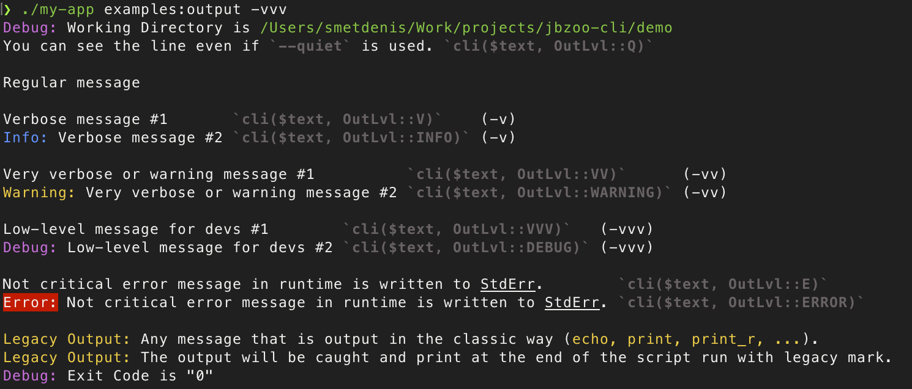
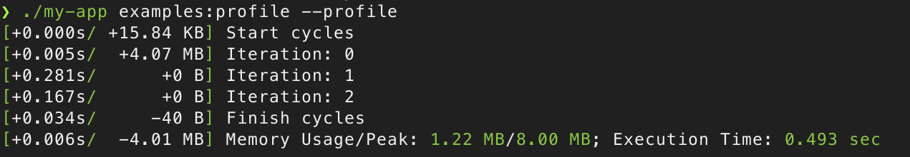
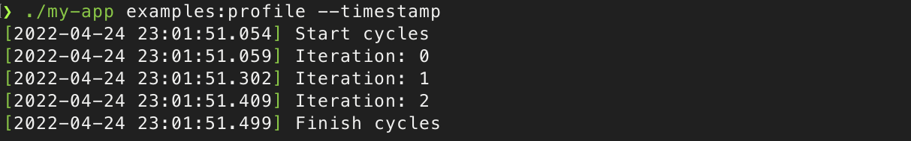

# JBZoo / Cli

[](https://github.com/JBZoo/Cli/actions/workflows/main.yml?query=branch%3Amaster)    [](https://coveralls.io/github/JBZoo/Cli?branch=master)    [](https://shepherd.dev/github/JBZoo/Cli)    [](https://shepherd.dev/github/JBZoo/Cli)    [](https://www.codefactor.io/repository/github/jbzoo/cli/issues)    
[](https://packagist.org/packages/jbzoo/cli/)    [](https://packagist.org/packages/jbzoo/cli/stats)    [](https://packagist.org/packages/jbzoo/cli/dependents?order_by=downloads)    [](https://github.com/JBZoo/Cli/blob/master/LICENSE)


The library greatly extends the functionality of [Symfony/Console](https://symfony.com/doc/current/components/console.html) and helps make creating new console utilities in PHP quicker and easier.

 * Improved progress bar with a new template and additional information. See [ExamplesProgressBar.php](demo/Commands/ExamplesProgressBar.php).
 * Convert option values to a strict variable type. See [ExamplesOptionsStrictTypes.php](demo/Commands/ExamplesOptionsStrictTypes.php).
 * New built-in styles and colors for text output. See [ExamplesStyles.php](demo/Commands/ExamplesStyles.php).
 * A powerful alias `$this->_($messages, $level)` instead of `output->wrileln()`. See [ExamplesOutput.php](demo/Commands/ExamplesOutput.php).
 * Display timing and memory usage information with `--profile` option.
 * Show timestamp at the beginning of each message with `--timestamp` option.
 * Mute any sort of errors. So exit code will be always `0` (if it's possible) with `--mute-errors`. 
 * None-zero exit code on any StdErr message with `--non-zero-on-error` option.
 * For any errors messages application will use StdOut instead of StdErr `--stdout-only` option (It's on your own risk!).
 * Disable progress bar animation for logs with `--no-progress` option.
 * Shortcut for crontab `--cron`. It's basically focused on logs output. It's combination of `--timestamp --profile --stdout-only --no-progress -vv`.

## Live Demo

[](https://asciinema.org/a/486674)


## Installing

```sh
composer require jbzoo/cli
```


## Usage Example

The simplest CLI application has the following file structure. See the [Demo App](demo) for more details.

```
/path/to/app/
    my-app                      # Binrary file (See below)
    composer.json               # Composer file
    /Commands/                  # Commands directory
        Simple.php              # One of the commands (See below)
    /vendor/
        autoload.php            # Composer autoload
```


[./demo/composer.json](demo/composer.json)

<details>
  <summary>See Details</summary>

  ```json
  {
      "name"        : "vendor/my-app",
      "type"        : "project",
      "description" : "Example of CLI App based on JBZoo/CLI",
      "license"     : "MIT",
      "keywords"    : ["cli", "application", "example"],
  
      "require"     : {
          "php"       : ">=7.4",
          "jbzoo/cli" : "^2.0.0"
      },
  
      "require-dev" : {
          "roave/security-advisories" : "dev-latest"
      },
  
      "autoload"    : {
          "psr-4" : {"DemoApp\\" : ""}
      },
  
      "bin"         : ["my-app"]
  }
  ```

</details>


Binary file: [demo/my-app](demo/my-app)

<details>
  <summary>See Details</summary>

  ```php
  #!/usr/bin/env php
<?php declare(strict_types=1);

namespace DemoApp;

use JBZoo\Cli\CliApplication;

// Init composer autoloader
require_once __DIR__ . '/vendor/autoload.php';

// Optional. Set your application name and version.
$application = new CliApplication('My Console Application', 'v1.0.0');

// Optional. Looks at the online generator of ASCII logos
// https://patorjk.com/software/taag/#p=testall&f=Epic&t=My%20Console%20App
$application->setLogo(
    <<<'EOF'
          __  __          _____                      _
         |  \/  |        / ____|                    | |          /\
         | \  / |_   _  | |     ___  _ __  ___  ___ | | ___     /  \   _ __  _ __
         | |\/| | | | | | |    / _ \| '_ \/ __|/ _ \| |/ _ \   / /\ \ | '_ \| '_ \
         | |  | | |_| | | |___| (_) | | | \__ \ (_) | |  __/  / ____ \| |_) | |_) |
         |_|  |_|\__, |  \_____\___/|_| |_|___/\___/|_|\___| /_/    \_\ .__/| .__/
                  __/ |                                               | |   | |
                 |___/                                                |_|   |_|
        EOF,
);

// Scan directory to find commands.
//  * It doesn't work recursively!
//  * They must be inherited from the class \JBZoo\Cli\CliCommand
$application->registerCommandsByPath(__DIR__ . '/Commands', __NAMESPACE__);

// Optional. Action name by default (if there is no arguments)
$application->setDefaultCommand('list');

// Run application
$application->run();
  
  ```

</details>


The simplest CLI action: [./demo/Commands/Simple.php](demo/Commands/Simple.php)

<details>
  <summary>See Details</summary>

  ```php
  <?php declare(strict_types=1);
  
  namespace DemoApp\Commands;
  
  use JBZoo\Cli\CliCommand;
  use JBZoo\Cli\Codes;
  
  class Simple extends CliCommand
  {
      protected function configure(): void
      {
          // Action name. It will be used in command line.
          // Example: `./my-app simple`
          $this->setName('simple');
  
          // Defined inhereted CLI options. See ./src/CliCommand.php for details.
          parent::configure();
      }
  
      protected function executeAction(): int
      {
          // Your code here
          $this->_('Hello world!');
  
          // Exit code. 0 - success, 1 - error.
          return self::SUCCESS;
      }
  }
  ```

</details>


## Built-in Functionality

### Sanitize input variables

As live-demo take a look at demo application - [./demo/Commands/ExamplesOptionsStrictTypes.php](demo/Commands/ExamplesOptionsStrictTypes.php).

Try to launch `./my-app examples:options-strict-types`.

```php
// If the option has `InputOption::VALUE_NONE` it returns true/false.
// --flag-name
$value = $this->getOpt('flag-name');         // `$value === true` 

// --flag-name="    123.6   "
$value = $this->getOpt('flag-name');         // Returns the value AS-IS. `$value ===  "   123.6   "`

// --flag-name="    123.6   "
$value = $this->getOptBool('flag-name');     // Converts an input variable to boolean. `$value === true`

// --flag-name="    123.6   "
$value = $this->getOptInt('flag-name');      // Converts an input variable to integer. `$value === 123`

// --flag-name="    123.6   "
$value = $this->getOptFloat('flag-name');    // Converts an input variable to float. `$value === 123.6`

// --flag-name="    123.6   "
$value = $this->getOptString('flag-name');   // Converts an input variable to trimmed string. `$value === "123.6"`

// --flag-name=123.6
$value = $this->getOptArray('flag-name');    // Converts an input variable to trimmed string. `$value === ["123.6"]`

// --flag-name="15 July 2021 13:48:00"
$value = $this->getOptDatetime('flag-name'); // Converts an input variable to \DateTimeImmutable object.

// Use standard input as input variable.
// Example. `echo " Qwerty 123 " | php ./my-app examples:agruments`
$value = self::getStdIn();                   // Reads StdIn as string value. `$value === " Qwerty 123 \n"`
```


### Rendering text in different colors and styles

There are list of predefined colors

```html
<black>  Text in Black color  </black>
<red>    Text in Red Color    </red>
<green>  Text in Green Color  </green>
<yellow> Text in Yellow Color </yellow>
<blue>   Text in Blue Color   </blue>
<magenta>Text in Magenta Color</magenta>
<cyan>   Text in Cyan Color   </cyan>
<white>  Text in White Color  </white>

<!-- Usually default color is white. It depends on terminal settings. -->
<!-- You should use it only to overwrite nested tags. -->
<default>Text in Default Color</default>
```

There are list of predefined styles

```html
<bl>Blinked Text</bl>
<b>Bold Text</b>
<u>Underlined Text</u>
<r>Reverse Color/Backgroud</r>
<bg>Change Background Only</bg>
```

Also, you can combine colors ans styles.

```html
<magenta-bl>Blinked text in magenta color</magenta-bl>
<magenta-b>Bold text in magenta color</magenta-b>
<magenta-u>Underlined text in magenta color</magenta-u>
<magenta-r>Reverse text in magenta color</magenta-r>
<magenta-bg>Reverse only background of text in magenta color</magenta-bg>
```

And predefined shortcuts for standard styles of Symfony Console

```html
<i> alias for <info>
<c> alias for <commnet>
<q> alias for <question>
<e> alias for <error>
```


### Verbosity Levels

Console commands have different verbosity levels, which determine the messages displayed in their output. 

As live-demo take a look at demo application - [./demo/Commands/ExamplesOutput.php](demo/Commands/ExamplesOutput.php). You can see [Demo video](https://asciinema.org/a/486674).

Example of usage of verbosity levels

```php
// There two strictly recommended output ways:
$this->_($messages, $verboseLevel); // Prints a message to the output in the command class which inherits from the class \JBZoo\Cli\CliCommand
cli($messages, $verboseLevel);      // This is global alias function of `$this->_(...)`. It's nice to have it if you want to display a text from not CliCommand class.

// * `$messages` can be an array of strings or a string. Array of strings will be imploded with new line.
// * `$verboseLevel` is one of value form the class \JBZoo\Cli\OutLvl::* 
```

```bash
# Do not output any message
./my-app examples:output -q
./my-app examples:output --quiet

# Normal behavior, no option required. Only the most useful messages.
./my-app examples:output 

# Increase verbosity of messages
./my-app examples:output -v

# Display also the informative non essential messages
./my-app examples:output -vv

# Display all messages (useful to debug errors)
./my-app examples:output -vvv
```

As result, you will see




### Memory and time profiling

As live-demo take a look at demo application - [./demo/Commands/ExamplesProfile.php](demo/Commands/ExamplesProfile.php).

Try to launch `./my-app examples:profile --profile`.




### Easy logging

No need to bother with the logging setup as Symfony/Console suggests. Just add the `--timestamp` flag and save the output to a file. Especially, this is very handy for saving cron logs.

```bash
./my-app examples:profile --timestamp >> /path/to/crontab/logs/`date +\%Y-\%m-\%d`.log
```




### Helper Functions

As live-demo take a look at demo application - [./demo/Commands/ExamplesHelpers.php](demo/Commands/ExamplesHelpers.php).

Try to launch `./my-app examples:helpers`.

JBZoo/Cli uses [Symfony Question Helper](https://symfony.com/doc/current/components/console/helpers/questionhelper.html) as base for aliases.

#### Regualar question

Ask any custom question and wait for a user's input. There is an option to set a default value.

```php
$yourName = $this->ask("What's your name?", 'Default Noname');
$this->_("Your name is \"{$yourName}\"");
```

#### Ask user's password

Ask a question and hide the response. This is particularly convenient for passwords.
There is an option to set a random value as default value.

```php
$yourSecret = $this->askPassword("New password?", true);
$this->_("Your secret is \"{$yourSecret}\"");
```

#### Ask user to select the option

If you have a predefined set of answers the user can choose from, you could use a method `askOption` which makes sure
that the user can only enter a valid string from a predefined list.
There is an option to set a default option (index or string).

```php
$selectedColor = $this->askOption("What's your favorite color?", ['Red', 'Blue', 'Yellow'], 'Blue');
$this->_("Selected color is {$selectedColor}");
```

#### Represent a yes/no question

Suppose you want to confirm an action before actually executing it. Add the following to your command.

```php
$isConfirmed = $this->confirmation('Are you ready to execute the script?');
$this->_("Is confirmed: " . ($isConfirmed ? 'Yes' : 'No'));
```

#### Rendering key=>value list

If you need to show an aligned list, use the following code.

```php
use JBZoo\Cli\CliRender;

$this->_(CliRender::list([
    "It's like a title",
    'Option Name' => 'Option Value',
    'Key' => 'Value',
    'Another Key #2' => 'Qwerty',
], '*')); // It's bullet character
``` 

```text
 * It's like a title
 * Option Name   : Option Value
 * Key           : Value
 * Another Key #2: Qwerty
```


## Useful projects and links

* [Symfony/Console Docs](https://symfony.com/doc/current/components/console.html)
* [kevinlebrun/colors.php - New colors for the terminal](https://github.com/kevinlebrun/colors.php)
* [php-school/cli-menu - Interactive menu with nested items](https://packagist.org/packages/php-school/cli-menu)
* [nunomaduro/collision - Beautiful error reporting](https://github.com/nunomaduro/collision)
* [splitbrain/php-cli - Lightweight and no dependencies CLI framework](https://packagist.org/packages/splitbrain/php-cli)
* [thephpleague/climate - Allows you to easily output colored text, special formats](https://github.com/thephpleague/climate)
* [Exit Codes With Special Meanings](https://tldp.org/LDP/abs/html/exitcodes.html)


## License

MIT


## See Also

- [CI-Report-Converter](https://github.com/JBZoo/CI-Report-Converter) - Converting different error reports for deep compatibility with popular CI systems.
- [Composer-Diff](https://github.com/JBZoo/Composer-Diff) - See what packages have changed after `composer update`.
- [Composer-Graph](https://github.com/JBZoo/Composer-Graph) - Dependency graph visualization of composer.json based on mermaid-js.
- [Mermaid-PHP](https://github.com/JBZoo/Mermaid-PHP) - Generate diagrams and flowcharts with the help of the mermaid script language.
- [Utils](https://github.com/JBZoo/Utils) - Collection of useful PHP functions, mini-classes, and snippets for every day.
- [Image](https://github.com/JBZoo/Image) - Package provides object-oriented way to manipulate with images as simple as possible.
- [Data](https://github.com/JBZoo/Data) - Extended implementation of ArrayObject. Use files as config/array. 
- [Retry](https://github.com/JBZoo/Retry) - Tiny PHP library providing retry/backoff functionality with multiple backoff strategies and jitter support.
- [SimpleTypes](https://github.com/JBZoo/SimpleTypes) - Converting any values and measures - money, weight, exchange rates, length, ...
